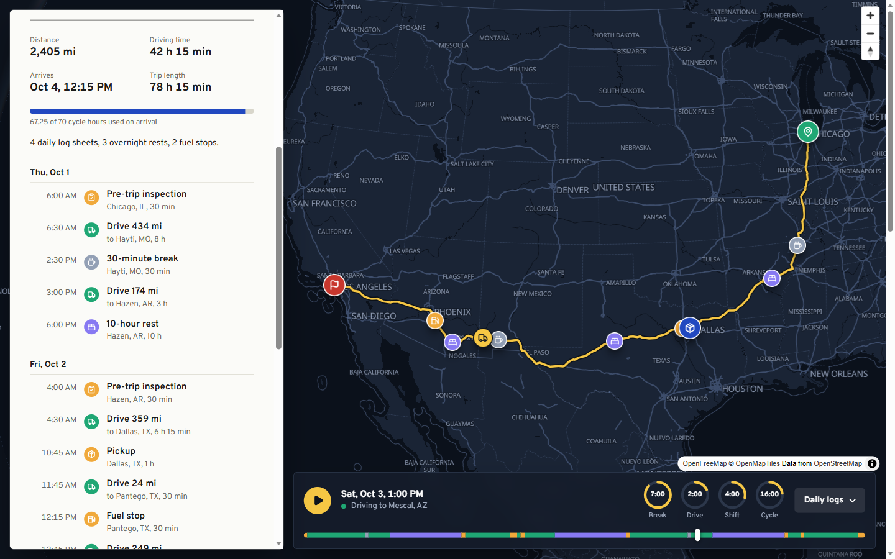
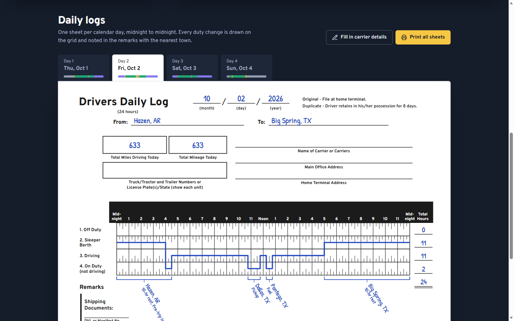

# Driveline

Trip planner for truck drivers. Enter where the truck is, the pickup, the drop-off and the hours already used in the current cycle. It returns the route, every stop the hours-of-service rules require, and a filled-in Driver's Daily Log for each day of the trip.

Live: https://driveline-eld.vercel.app




## What it does

- Routes current location → pickup → drop-off and draws it on the map with every stop: pre-trip inspections, pickup, drop-off, fuel, 30-minute breaks, 10-hour rests and 34-hour restarts.
- Lists the trip as an itinerary with times, places and miles.
- Fills in one log sheet per calendar day: the duty graph, remarks with the nearest town at each change of duty status, total hours per line, miles driven and the 70-hour recap. Sheets print one per page.
- Replays the trip on the map with the four clocks a driver watches (break, drive, shift, cycle) counting down.

## Rules applied

Property-carrying driver, 70 hours / 8 days, no adverse driving conditions.

| Rule | How it is applied |
| --- | --- |
| 11-hour driving limit | No more than 11 hours of driving after 10 consecutive hours off. |
| 14-hour window | No driving after the 14th hour since the shift started. |
| 30-minute break | Required once 8 hours of driving have built up. Any stop of 30 minutes or more counts, so fuel and pickup reset it too. |
| 10-hour rest | Logged in the sleeper berth. Resets the 11- and 14-hour limits. |
| 70 hours in 8 days | Driving and on-duty time add to the cycle hours entered. When they run out the driver takes a 34-hour restart. |
| Fuel | At least every 1,000 miles, 30 minutes on duty. |
| Pickup and drop-off | 1 hour on duty each. |
| Pre-trip inspection | 30 minutes on duty at the start of every shift. |

Things worth knowing:

- Times are rounded to 15 minutes, the resolution of the paper log grid, and each leg's drive time is rounded up.
- The driver is assumed to start the trip fully rested.
- Only a single "cycle used" number is known, not which days those hours fell on, so none of them are assumed to drop off during the trip. That is why recap lines A and C show the same total.
- All times are home terminal time.

## How it is built

```
backend/            Django + Django REST Framework
  planner/hos.py      the hours-of-service simulation
  planner/logs.py     splits the trip into daily log sheets
  planner/routing.py  OSRM client, builds a distance/time profile of each leg
  planner/places.py   place search (Photon) and nearest-town lookup
  planner/trips.py    ties the above together into the API response
frontend/           React + TypeScript + Vite + Tailwind
  components/RouteMap.tsx   MapLibre map, route and stop markers
  components/LogSheet.tsx   the daily log, drawn as SVG
  components/Replay.tsx     trip scrubber and HOS clocks
api/index.py        entry point for Vercel's Python runtime
```

The backend is stateless, so there is no database. `POST /api/trips/plan` takes the three places, cycle hours and departure time and returns the whole plan. `GET /api/places?q=` powers the location autocomplete from the bundled city list; adding `&addresses=1` searches streets and businesses through Photon.

The planner walks the trip in 15-minute steps. Before each step it checks the clocks and, if driving is not allowed, inserts whatever stop clears the way: a rest, a break or fuel. Stop locations come from the route's own distance and time profile, so a rest at hour 11 lands where the truck would actually be.

## Run it locally

Backend (Python 3.12):

```bash
cd backend
python -m venv .venv && source .venv/bin/activate   # Windows: .venv\Scripts\activate
pip install -r ../requirements.txt
python manage.py runserver
```

Frontend (Node 20+):

```bash
cd frontend
npm install
npm run dev
```

Open http://localhost:5173. The dev server proxies `/api` to Django on port 8000.

Tests and linting:

```bash
cd backend && python manage.py test && ruff check .
cd frontend && npm run lint
```

## Deployment

One Vercel project serves both halves: the Vite build as static files and Django as a Python function behind `/api`. See `vercel.json`. Set `DJANGO_SECRET_KEY` in the project's environment variables.

## Data and services

- Routing: [OSRM](https://project-osrm.org/) public server, with the FOSSGIS instance as a fallback
- Place search: cities come from the bundled list and show instantly; streets and addresses come from [Photon](https://photon.komoot.io/)
- Map tiles: [OpenFreeMap](https://openfreemap.org/), © OpenStreetMap contributors
- Town names: [GeoNames](https://www.geonames.org/) (CC BY 4.0)
- Rules: FMCSA Interstate Truck Driver's Guide to Hours of Service (April 2022)
